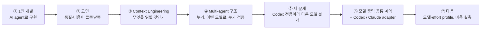

# AI Agentic Coding System — Context Engineering · Multi-agent · 모델 중립 Workflow

1인 풀스택 서비스(대학생 룸메이트 매칭, 비공개 저장소)를 AI coding agent와 개발하면서
**"agent가 누가·언제 일해도 같은 품질과 예측 가능한 비용으로 결과를 내게 하려면?"**이라는 질문을 풀어 온 과정과 결과물입니다.
이 저장소에는 그 과정에서 만든 workflow 문서·역할 설정·검증 코드를 발췌했습니다(학교 식별 정보 제거, 제품 코드 미포함).

## 한눈에 보기

| 시기 | 단계 | 고민(문제) | 선택(해결) | 확인한 결과 |
|---|---|---|---|---|
| 2026-03 | ① 1인 개발 시작 | 혼자서 기획·FE·BE·인프라를 모두 해야 함 | AI agent에게 구현을 맡기고, 공통 규칙은 `AGENTS.md` 하나에 모음 | agent가 저장소 규칙을 읽고 작업 |
| 2026-03~08 | ② 품질 편차 발견 | 같은 요청도 대화 이력·개인 설정에 따라 결과가 달라지고, "완료"라는 보고와 실제가 다름 | "agent의 말"이 아니라 **테스트·CI·diff**로 완료를 판정하기로 함 | 완료 기준을 실행 결과로 고정 |
| 2026-08 | ③ Context Engineering | 오래된 대화·로그가 최신 코드보다 우선되고, 필요 없는 문서까지 읽어 비용 낭비 | 신뢰 순서(현재 요청 → 코드 → 정책 → 계획 → 과거 기록), 필요한 문서만 단계적으로 읽기, 요청 분석·계획 하네스 | 작업마다 읽을 문서와 근거가 정해짐 |
| 2026-08-31 | ④ Multi-agent 구조 (Codex) | 모든 작업을 비싼 모델로 하거나, 위험해 보이는 단어로 추론 강도를 정해 비용·품질이 흔들림 | 필요할 때만 위임, 쓰기 담당 1명, 저장소를 읽은 뒤 **위험도와 추론 난이도를 분리**해 모델·effort 결정, 독립 리뷰 | 구현·조사·추출을 저가 모델로 실행해 사전 기준·독립 QA 통과(09-24 실측) |
| 2026-09 | ⑤ 새 문제 | 주간 사용량 한도로 도구를 바꿔야 했는데, workflow가 Codex에 묶여 다른 agent·모델에서는 같은 품질 절차가 적용되지 않음 | 기존 구조를 복제하지 않고 **공통 계약을 먼저 추상화**하기로 결정 | — |
| 2026-09-27 | ⑥ 모델 중립 workflow | 문서·코드·테스트 곳곳에 특정 도구의 전제가 섞여 있음 | 문서 71개와 Codex 의존 후보 341곳을 감사해 공통/전용으로 분리, Codex도 공통 계약의 "사용자"로 재연결 | 공통 계약·Codex 재연결 병합, 가상의 제3 도구로 확장성 테스트 |
| 2026-09-28 | ⑥-2 Claude Code 연결 | 새 도구에서도 모델 통제·독립 검증이 실제로 지켜지는가 | Claude Code adapter: 등록된 작업만 실행, 모델 사전 검사, 실행 후 실제 모델 대조, 독립 리뷰 | 잘못된 모델 요청 차단, 독립 리뷰가 결함 5건 적발 |
| 다음 | ⑦ 설계 단계 | Claude에서 추론 강도(effort)가 통제되지 않음, 비용 절감 여부가 측정되지 않음 | 역할 × 모델 × effort profile, 실패 원인별 복구, 전체 비용 실측 | [ROADMAP.md](ROADMAP.md) |

## 해결한 문제와 방법

### 1. Context Engineering — "무엇을, 언제, 얼마나 읽힐 것인가"
| 문제 | 해결 |
|---|---|
| 오래된 대화·메모가 현재 코드보다 우선됨 | **신뢰 순서 고정**: 현재 요청 → 현재 코드·테스트 → 정책/설계 문서 → 활성 계획 → 과거 기록 |
| 모든 문서를 읽어 context·비용 낭비 | 문서를 graph로 연결하고 **작업에 필요한 최소 문서만** 단계적으로 읽기 |
| 위임할 때 전체 대화를 넘김 | 목적·범위·근거 위치·완료 기준·중단 조건만 담은 **작업 packet** |
| 긴 작업이 대화 기억에 의존 | 목표·branch·변경 파일·검증·다음 행동만 남기는 **짧은 인계 기록**, 모든 도구가 같은 계획 폴더 사용 |

### 2. Multi-agent 구조 — "누가, 어떤 모델로, 누가 검증하는가"
| 문제 | 해결 |
|---|---|
| agent를 많이 쓸수록 좋다는 착각 | **direct-first**: 도구 → 단일 agent → 독립적인 일이 있을 때만 위임 |
| 여러 agent가 같은 파일을 수정 | **쓰기 담당은 한 명**, 결과 통합·판정은 리더만 |
| 위험한 단어 = 어려운 작업이라는 오판 | 저장소를 읽은 뒤 **위험도와 추론 난이도를 분리**해 두 번 판정 |
| 비싼 모델 일괄 사용 vs 저가 모델의 품질 위험 | 검증 가능한 작업만 저가 모델, 기본·최종 검토는 상위 모델, 실패 시 **한 번만** 복구 |
| 만든 사람이 스스로 PASS | **별도 컨텍스트의 리뷰어**가 요구사항·diff만 보고 판정하고, 리더가 지적을 재현해 확정 |

### 3. 모델 중립 workflow — "도구가 바뀌어도 같은 절차"
| 문제 | 해결 |
|---|---|
| workflow가 한 도구에 묶여 있음 | **공통 계약**(권한 → 문서 탐색 → 위임 → 독립 검토 → 인계)과 **도구별 adapter** 분리 |
| 기존 도구의 좋은 동작을 잃을 위험 | 기존 동작을 **회귀 테스트로 고정**한 뒤 재연결(구조·버그는 보존하지 않음) |
| 새 도구 추가 시 공통 코드 수정 필요 | 가상의 제3 도구를 붙이는 **적합성 테스트** |
| "설정 파일이 있다 = 지켜진다"는 착각 | 규칙마다 강도 표기: 테스트로 강제 / 문서 권고 / agent 판단 / 도구가 강제 |
| 통제 장치(hook)가 고장 나면? | 공식 문서 원문으로 "고장 시 통제가 풀린다"를 확인하고, 권한 규칙과 결합해 **고장 시 사람 승인**으로 넘어가게 재설계 |

## 결과와 근거

- 공통 계약·Codex 재연결 변경 병합, Claude Code adapter는 CI 통과(병합 전).
- workflow 테스트 467개, 저장소 정책 테스트 1,116개 통과.
- 상세 수치와 한계: [EVIDENCE.md](EVIDENCE.md) / 설계만 된 항목: [ROADMAP.md](ROADMAP.md)
- 측정하지 않은 것: 생산성·비용 절감률(단가 비율만 확인, 전체 사용량 비교는 다음 과제).

## 저장소 구성

| 경로 | 내용 |
|---|---|
| `AGENTS.md`, `CLAUDE.md` | 모든 agent가 읽는 공통 규칙 / Claude Code 진입점 |
| `docs/development/agentic-engineering-methodology.md` | 채택한 방법론과 적용 수준 |
| `docs/development/agentic-orchestration-case-study.md` | multi-agent·모델 라우팅의 문제·대안·실측·한계 |
| `docs/development/agent-workflows/` | 공통 계약과 `adapters/`(Codex·Claude Code) |
| `.codex/`, `.claude/` | 도구별 역할 정의와 설정 |
| `scripts/agents/` | 공통 계약·라우팅·검증을 실제로 수행하는 코드 |
| `scripts/ci/` | 회귀·negative 테스트 |

발췌본이라 원 저장소의 다른 문서로 가는 일부 링크는 열리지 않습니다.
