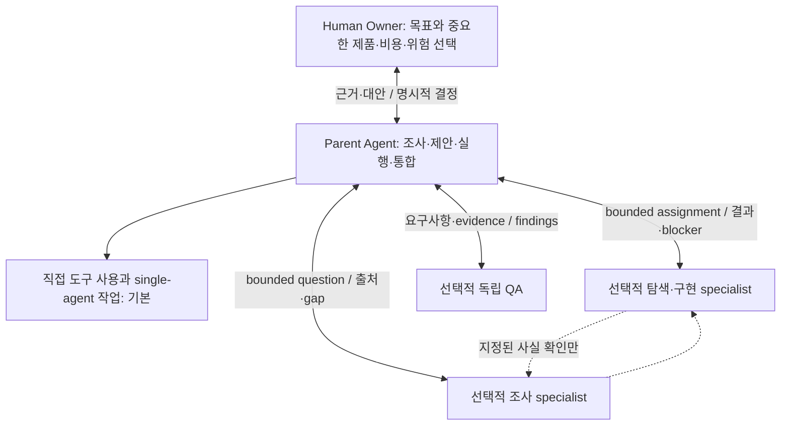

# Owner–Lead collaboration

이 문서는 FE·BE·Infra를 포함한 repository 작업에서 **사람이 결정할 중요한 선택**과 **Agent가 진행할 기술 작업**을
구분합니다. Owner는 제품 목표와 중요한 비용·위험을 결정하고, Parent Agent(Lead)는 조사·제안·실행·통합을 소유합니다.
기본은 Lead의 직접 작업이며, 독립적인 전문 관점이 유용할 때만 bounded specialist를 호출합니다.

이 구조는 고정 인원의 회사 조직이나 자동 실행 엔진이 아닙니다. “동료”, “Tech/Design Lead”, “QA”, “DevOps”는 책임을
설명하는 비유입니다. 기술적 세부 결정까지 모두 사람에게 돌려보내거나, 사람의 제품 판단을 Agent가 대신하지 않습니다.
근거와 기각 대안은 [Architecture decisions](./agentic-architecture-decisions.md)의 DA-013~015에서 추적합니다.

## 결정권과 안전한 다음 행동

| 상황                                               | Lead의 행동                                                 | 결정 owner         |
| -------------------------------------------------- | ----------------------------------------------------------- | ------------------ |
| 요청·정책·예산·권한 안의 명확한 기술 작업          | 기존 패턴으로 실행하고 가까운 검증 수행                     | Lead               |
| 사실이 부족하지만 안전한 조사로 좁힐 수 있음       | code/contract/test를 읽고 사실·추론·gap 분리                | Lead               |
| 현재 승인 범위를 바꾸는 중요한 제품·비용·위험 선택 | 짧은 대안과 권장안, 필요한 선택을 제시                      | Human Owner        |
| 외부 provider·실제 배포 값이 아직 정해질 수 없음   | 기존 release readiness/evidence owner로 handoff             | 해당 release owner |
| Child의 blocker, 상충 결과 또는 scope 변경 요청    | 근거로 판정하고 재배정·순차화; 중요한 선택만 Owner에게 보고 | Parent             |

중요한 선택은 현재 승인된 제약에 비추어 판단합니다. 사용자에게 보이는 정책/행동의 범위 변경, 새로운 반복 외부 비용,
보안·개인정보·데이터 손실 위험의 수용, release target·rollback 경계 변경, 이미 합의한 방향의 변경이 그 예입니다.
금액·파일·commit 개수의 보편 threshold를 만들지 않습니다. 이미 승인된 변경을 구현한다는 이유로 다시 협의를 요구하지 않습니다.

함수명·기존 library API 사용·테스트 명령·범위 내 안전한 수정은 Lead가 선택합니다. 승인된 tool 사용이나 bounded child
호출 자체를 매번 새 유료 서비스 결정으로 취급하지 않습니다. 실제 sandbox/credential 승인은 host의 절차를 따릅니다.
업무 승인·실행 권한·외부 입력·삭제·실행 모드의 구체적인 경계는
[Execution authority](./agent-execution-contract.md#execution-authority)가 소유합니다. 이 문서는 제품·비용·위험 선택을
협의하는 책임을 유지하며 별도 명령 승인 정책을 복제하지 않습니다.

Owner가 제안한 수단이 관찰한 제약과 충돌하면 근거와 가능한 경로를 제시하되 **명시적인 결정을 몰래 교체하지 않습니다**.
기존 assistant 점수나 추측을 사실로 방어하지 않습니다. Owner의 침묵·시간 경과·선택지 기본값은 승인이 아닙니다.
기다려야 하는 경계만 멈추고 독립적인 승인 범위의 작업은 계속할 수 있습니다.

## 짧은 협의: decision packet

실제 선택이 필요한 경우 기존 [Decision/OQ](./plan-authoring/core.md#5-decision-oq-and-future-evidence) 내용을 간결하게 제시합니다.
새 schema, 매번 남기는 회의록, 별도 decision ledger 또는 고정 답변 양식이 아닙니다.

```text
무엇을 결정해야 하는가? 목표와 현재 제약
확인된 사실 / 불확실한 부분
가능한 대안 — 유효하다면 유지·변경하지 않기 포함
권장안과 이유 / 가장 강한 반론
관련된 제품·비용·위험·유지보수·rollback 영향
구분에 필요한 최소 검증 또는 Owner에게 필요한 한 가지 선택
지금 진행할 수 있는 일 / 기다려야 하는 일
```

정해진 개수의 대안을 억지로 채우지 않습니다. 단순 답변은 짧게 답하고, 분석만 요청했다면 권장을 제공하되 구현 승인을
받는 단계까지 자동 확장하지 않습니다. 필요한 질문은 조사 후에도 남는 중요한 분기 하나에 집중합니다.
처리는 기존 [ambiguity disposition](./request-intake/ambiguity-and-authority.md)을 사용합니다. 채택한 장기 결정은 기존
policy/architecture/PR/Issue owner에 연결하고, 미래 관찰은 [lifecycle](./development-lifecycle.md)에 맡깁니다.

## 필요한 관점만 참고하기

Lead는 현재 source/owner를 확인한 뒤 관련 primary domain guide의 필요한 부분을 참고할 수 있습니다. Plan만을 위한
전체 체크리스트를 Answer·Analyze·Implement에 강제로 적용하는 것이 아닙니다.

- 중복 요청 분석: [Backend](./plan-authoring/backend.md)의 transaction·uniqueness·idempotency 관점.
- Infra 용량 선택: [Infrastructure](./plan-authoring/infrastructure.md)의 비용·실패 격리·복구 관점.
- FE 상태/접근성 분석: [Frontend](./plan-authoring/frontend.md), 실제 시각적 질문에는 [Visual design](./visual-design/README.md).
- 승인된 구현: 현재 계획과 owner evidence를 우선하고, 실제 drift가 있을 때만 해당 관점을 다시 확인.

주 관점 하나에서 시작하고 cross-cutting 관점은 구체적 근거가 요구할 때만 추가합니다. `BE 개선` 같은 약어만으로 owner나
수정 권한을 단정하지 않습니다. 작은 lookup/기지의 수정은 바로 처리하고, owner가 불명확하면 조사하거나 중요한 분기를 묻습니다.

이는 **model-mediated consultation**입니다. [ContextPack](./request-intake/context-pack.md)의 deterministic `selectedGuides`나
TaskEnvelope/schema를 바꾸지 않습니다. Non-Plan mapper의 빈 guide 목록을 임의로 채우지 않으며, 참고한 경로가 유용하면
기존 작업/검토 evidence에 별도로 남깁니다. 문서를 읽는 것이 Plan artifact 생성·구현·Child 생성 권한을 주지 않습니다.

## 선택적 specialist와 중앙 책임

Role·effort·count·독립성·one-writer 판정은 기존 [Orchestration](./orchestration.md)과
[Child task contract](./request-intake/delegation.md)를 재사용합니다. 직군 이름만으로 agent 수나 새 host 역할 설정을 만들지 않습니다.
아래 `repo_*` 이름과 TOML은 **Codex mapping 예시**이며 공통 역할 식별자가 아닙니다. 다른 host는
[현재 adapter](./adapters/README.md)의 조사·구현·검토 역할과 실제 tool 권한을 확인합니다.

| 필요한 관점            | 기존 경로                                      | 경계                                                                     |
| ---------------------- | ---------------------------------------------- | ------------------------------------------------------------------------ |
| 저장소 사실/owner 탐색 | `repo_explorer`                                 | 근거 반환, 최종 설계 결정 아님                                           |
| 외부 기술 근거         | `repo_researcher`                               | 출처·시점·gap, 최종 채택은 Lead/Owner                                    |
| FE·BE·DevOps 구현      | Lead 또는 `repo_executor`                       | 지정한 파일/명령; 직군명이 배포 권한을 주지 않음                         |
| QA·보안 검토           | `repo_reviewer`, 별도 권한 있는 test runner     | [QA](./qa.md) owner의 독립 검토/runner 분리                              |
| Designer·UX·Data 분석  | Lead 또는 기존 역할의 목적에 맞는 bounded 작업 | 실제 입력·권한만 사용; 가상 조사/수치를 실제 사용자 증거로 포장하지 않음 |

맞는 역할이 없으면 Lead가 직접 처리합니다. 정책→설계→구현→QA처럼 결과 의존성이 있는 단계는 순차 실행합니다.
독립 lane은 peer 답변을 기다리지 않아도 완료 가능해야 합니다. 반복 질문이 필수가 되면 Parent가 범위를 다시 나누거나
순차화합니다. 다수결이나 같은 모델의 반복 답변을 독립 증거로 세지 않습니다.

Primary 분석을 한 owner에 배정하고 이미 해결한 문제를 반복하지 않는 기준은
[orchestration의 증거 재사용](./orchestration.md#primary-작업과-증거-재사용)을 따릅니다. 독립 QA와 필요한 실패 재현은
비용 절감을 이유로 생략하지 않습니다.

## 통신: 기본은 Parent 경유, 예외는 지정된 사실 확인

Parent만 assignment·재배정·scope/file owner 변경·충돌 해결·결과 판정·통합을 소유합니다. Child의 결과·blocker·결정 요청은
Parent에게 돌아옵니다. **Child가 다른 child를 만들거나 자신의 업무를 직접/간접 재위임하는 것은 금지**합니다.
Shell/subprocess나 외부 model/agent 서비스를 통한 offload도 같으며, 원래 배정된 일반 도구 사용과는 구별합니다.

직접 peer 메시지는 다음 조건을 모두 충족할 때만 허용합니다.

1. Parent가 실제 참여자 pair, 좁은 사실 주제, 허용된 읽기/evidence 범위와 현재 task/source snapshot을 지정합니다.
   기존 task text/allowed-tools/non-goals를 사용하며 새 권한 schema를 만들지 않습니다. 지정이 없으면 Parent 경유입니다.
2. 현재 host/role/도구 권한이 허용해야 합니다. Parent 지정은 상위 지침·sandbox·Conductor/Team 제약을 우회하지 못합니다.
   불명확하거나 더 좁은 제한이 있으면 Parent에게 알리고 중계 경로를 사용합니다.
3. 이미 가진 사실 또는 배정된 read scope에서 즉시 확인 가능한 symbol/contract/fixture/기존 test evidence만 짧게 교환합니다.
   source/snapshot과 불확실성을 붙입니다. 새 조사·테스트 실행·구현 요청·정책 제안·논쟁은 Parent에게 보냅니다.
4. 메시지는 근거이지 명령/승인이 아닙니다. 출처를 검증하고 secret/PII/raw transcript를 보내지 않습니다. Peer끼리 참여자·주제·
   scope·write owner·acceptance를 바꾸거나 권한을 전달할 수 없고, peer는 자신의 작업을 막지 않고 확인을 거절할 수 있습니다.
5. 반복 논의·상충·중요한 발견은 즉시 Parent에게 보고합니다. 통상적인 교환도 최종 결과에 참여자·주제·출처를 요약합니다.
   자동 CC/Parent 가시성을 가정하지 않습니다. 보고할 수 없다면 중계 경로를 사용합니다.
6. 완료·source/scope 변경·Parent 철회로 지정은 만료됩니다. 이후에는 재확인하고, 미지정/주제 밖 요청은 행동하지 않고
   Parent에게 보고합니다. 상시 열린 channel이나 unsolicited broadcast로 확장하지 않습니다.

Parent는 승인된 기술 작업 안에서 이 좁은 예외를 지정할 수 있으며 Owner에게 메시지마다 허락을 요청하지 않습니다.
새 업무·중요한 선택은 그대로 Parent/Owner 책임입니다. “기존 response schema 위치 확인”은 예외가 될 수 있지만
“내 구현을 대신 끝내줘”, “응답 계약을 함께 바꾸자”, “승인해줘”는 아닙니다.

**QA 독립성:** 상세 절차/packet/result는 [QA workflow](./qa.md)를 따릅니다. Reviewer는 frozen 요구사항과 source에서 먼저
acceptance/findings를 독립적으로 도출하며, 이 초기 단계에는 builder와 peer 대화하지 않습니다. 초기 판단 기록 후 Parent가
별도로 지정한 사실 확인은 가능하되 expected answer·self-PASS·설득을 교환하지 않습니다. 알려진 결함/gap을 숨기지 않고,
중요한 답변·finding 변경을 Parent에게 보고하며 source/가정 변경 시 관련 검증을 다시 수행합니다.

## 구조와 판단 흐름



실선은 작업·보고·결정 경로, 점선은 기본적으로 없는 제한된 정보 교환입니다. 초기 QA에는 builder peer edge가 없습니다.
Child 없는 경로가 기본이며 이 그림은 실제 상시 실행 인원이나 자동 OMX `$team` 실행을 나타내지 않습니다.

```text
요청 → 현재 source/owner 확인 → 승인된 제약 안의 명확한 작업인가?
  예 → 직접 실행 또는 근거 있는 bounded child → 검증 → Parent 보고
  아니오 → 안전한 조사 → 근거·대안·권장 → Owner 선택 / OQ / release handoff
새 근거·Child blocker → Parent가 범위·순서를 판정 → 중요한 선택만 Owner 협의
```

## 예시와 검증 한계

아래는 가상 시나리오이며 현재 제품의 결함·성능·사용자 선호를 주장하지 않습니다.

- **BE:** “중복 요청 때문에 Redis가 필요할까?”라는 분석 요청에는 DB uniqueness/transaction/idempotency와 Redis 대안을
  비교합니다. 기존 제약으로 해결된다면 유지안을 권할 수 있으며, Redis 설치나 요청하지 않은 plan 생성은 하지 않습니다.
- **Infra:** 가상 후보가 walltime 10→7분, compute 12→18분이라면 시간 절약과 compute 증가를 분리합니다. 실제 과금은
  별도 근거가 필요합니다. 비용 우선순위가 미정이면 그 선택만 묻고, 무단 유료 서비스 채택 대신 안전한 조사는 계속합니다.
- **FE:** “내용은 유지하되 다른 시각적 방향을 제안해줘”에는 보존할 문구/데이터/행동과 바꿀 스타일을 나눕니다. 기존 제품
  스타일을 미래 BackOffice의 필수 조건으로 만들지 않고, 기술 QA와 사람의 시각적 방향 승인을 구분합니다.

지침과 정적 검사는 hard communication ACL이나 모든 prompt의 준수를 보장하지 않습니다. 현재 도구의 노출이나 role
파일 존재도 실제 동작·effective runtime 설정의 증명이 아닙니다. 허용/거절·보고·QA 행동은 실제 task-scoped 관찰로
검증하고 미실행은 미실행으로 남깁니다. 위반 시도는 성공으로 포장하지 않습니다. 생산성·사용자 이익·실제 팀 협업은
별도 관측 대상이며, local evidence와 공유 가능한 근거의 owner는 기존 [QA](./qa.md)·[lifecycle](./development-lifecycle.md)를 따릅니다.
